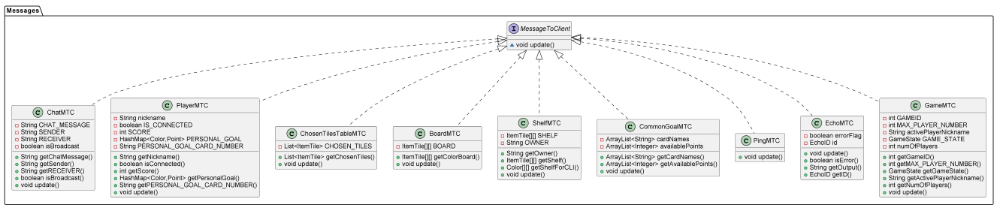
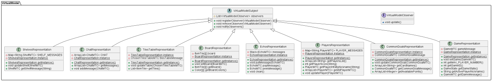

# **Communication Protocol**

##### The Compiler Coalition

## **Introduction**

In this paper there is the illustration of the communication protocol used in the game “MyShelfie”.

The problem consists of sending information between client and server,
so that the players can be updated on changes of the game and are able
to update the state of the game.

The determinant factor on which the architecture is based is the advanced feature “multiple games”. The main problem
faced on the implementation of this feature was that the server controller needed to be able to determine the game that
the client belonged to.

There was also the need for sending messages that were different from one another, that is because the game has
different states and there are possible actions for each of these states.

## **Implementation**

The implementation of the communication protocol in "MyShelfie" utilizes
the TCP protocol with socket communication.
The server is activated on port 28888, and clients can establish a connection
to initiate message exchange.

Upon accepting a connection, the server employs the SocketClientHandler class. This class is responsible for listening
to messages from each client and enables the server to send messages to the client. On the client side, the SocketClient
class
is utilized for sending and receiving messages to and from the server.

## **Messages to server**

To ensure consistency and flexibility, every message sent to the server
extends the abstract class "MessageToServer" and implements the "update()"
method. This method is invoked on the server when the message is received
and is responsible for executing the corresponding logic.

Let's take the example of the "InsertTileMTS" class:

`@Override
public void update() {
InsertTilesExecutor.execute(this);
}`

In this case, the execution of the message is delegated to a specific
executor designed for handling insert tile messages.

Since each executor is aware of the message type in advance,
the data can vary between messages. This design approach allows
for easy extension and management of messages, adhering to the principles
of open-closed and single responsibility.

**Choose the right game:**

To address the challenge of handling multiple games, the "MyShelfie"
implementation introduces the singleton class "GamesManager." This
class is responsible for dividing the incoming traffic to the correct game.

When a message arrives at the SocketClientHandler,
it adds the player's nickname, game ID, and a reference to the
SocketClientHandler as overhead to the message:

    //set the header necessary to identify the player in a game
    message.setSocketClientHandler(this);
    message.setGameId(this.gameID);
    message.setNickname(this.nickname);

Next, the SocketClientHandler calls the "onCommandReceived" method
of the GamesManager class:

`GamesManager.getInstance().onCommandReceived(message);`

The "onCommandReceived" method in GamesManager retrieves the game
associated with the given
game ID from the hash table "gamesData" and sets it in the message's header:

`message.setGame(gamesData.get(message.getGameID()));`

This ensures that each message contains the relevant game information.
Finally, the message is processed by calling the "update()" method,
which delegates the execution to static methods.
These methods utilize the data within the message to execute the necessary
instructions and potentially modify the game model accordingly.

## **Messages to client**

To communicate changes in the virtual model to the clients, the server
employs the Observable-Observer design pattern between the model (observable)
and the virtual view (observer).

**Virtual view:**

The virtual view consists of a logical
cluster of classes that are responsible for sending messages to the clients
when the model changes.
It is initialized upon creation of a new game and assigned to it.
The VirtualView class creates all the observer classes designed to send
specific type of messages to the client when notified.

Here is the UML diagram:

In order for the server to send messages to the clients, each message must
implement the MessageToClient interface and implement the update() method.
The purpose of this method is to update the virtual model, following the
Model-View-Controller (MVC) design pattern.

Let's consider the example of the BoardMTC class:

    @Override
    public void update() {
        BoardRepresentation.getInstance().setBoard(this);
    }

In this case, the update() method sets the updated board received in
the message to the BoardRepresentation singleton class in the virtual model.
This allows the player to view the updated board through the corresponding
view.

By utilizing this design pattern and updating the virtual model accordingly,
the server ensures that clients receive relevant updates and can visualize
the changes in the game's state.

**Virtual model:**

The virtual model is located in the controller section of the client,
and it is responsible for creating a mirror image of the game model,
so that the client can have the necessary data to view the game.
The virtual model is designed to be lightweight and only includes
essential data. To achieve this, each entity in the model is represented
by a singleton class in the virtual model.

Let's consider the example of the BoardRepresentation class:

    public void setBoard(BoardMTC board) {
        this.board = board.getColorBoard();
        notifyObservers();
    }

The setBoard() method is responsible for updating the "board"
attribute with the new board received as a parameter. After updating
the board, the method notifies all the observers. The observers,
in turn, handle this information based on their specific logic.
One common action is to update the view by retrieving the board using
the BoardRepresentation.getInstance().getBoard() method.

By utilizing the virtual model in this way, the client application can efficiently manage and handle the necessary
information from the server's model, allowing for appropriate updates and interactions within the client's view.

In conclusion, the communication protocol implemented in "MyShelfie" effectively handles multiple games and enables
seamless information exchange between clients and the server. The protocol utilizes TCP and socket communication, while
the GamesManager class ensures accurate traffic division. The Observable-Observer design pattern facilitates model
updates to clients via messages implementing the MessageToClient interface. The lightweight virtual model, represented
by singleton classes, allows easy access to relevant information. Overall, the protocol ensures smooth gameplay and
adheres to key design principles, enhancing the player experience in "MyShelfie."

